## What is R?
R is a widely-used open-source programming language and software environment specifically designed for statistical computing and graphics. It was created by Ross Ihaka and Robert Gentleman at the University of Auckland, New Zealand, and first released in 1995. Since then, it has gained immense popularity and has become one of the most prominent tools for statistical analysis and data visualization.

Key features of R:

1. **Statistical Analysis:** R provides a comprehensive suite of statistical and graphical techniques, making it a powerful tool for data analysis, hypothesis testing, linear and nonlinear modeling, time-series analysis, clustering, and more.

2. **Data Manipulation:** R offers various data manipulation and transformation functions that allow users to clean, reshape, and process datasets efficiently.

3. **Data Visualization:** R has excellent data visualization capabilities, enabling users to create a wide range of static and interactive plots, charts, and graphs to explore and present data visually.

4. **Extensibility:** R's functionality can be extended through packages. Thousands of packages developed by the R community cover diverse domains like genomics, bioinformatics, machine learning, spatial analysis, and social sciences.

5. **Data Import/Export:** R supports a wide range of data formats, allowing users to import data from various sources and export results to different file formats for further analysis or presentation.

6. **Reproducible Research:** R's support for literate programming using tools like RMarkdown and Sweave facilitates reproducible research, where data analysis and results can be documented in a single document.

7. **Community Support:** R has a vibrant and active community of users and developers who contribute to its continuous improvement by developing packages, sharing knowledge, and providing support through forums and mailing lists.

## How to Get R and Get Started
Getting started with R is easy! Follow these steps to get R installed on your computer and begin using it:

1. **Download R:** Visit the official R website at <https://www.r-project.org/>. On the homepage, click on "CRAN" (Comprehensive R Archive Network) under the `"Download and Install R"` section. Choose the appropriate download link based on your operating system (Windows, macOS, or Linux).

2. **Install R:** Once the download is complete, run the installer and follow the installation instructions specific to your operating system. The process is typically straightforward and involves accepting the license agreement and selecting the installation location.

3. **Download RStudio (Optional but Recommended):** While R itself provides a command-line interface, many users prefer using RStudio, an integrated development environment (IDE) designed for R. RStudio provides a more user-friendly and feature-rich interface for working with R. You can download RStudio from <https://www.rstudio.com/products/rstudio/download/>.

4. **Install RStudio (Optional but Recommended):** Run the RStudio installer and follow the installation instructions. RStudio will automatically detect the R installation and integrate with it.

5. **Launch R or RStudio:** After installation, you can open R by clicking on its icon or launching it from the Start menu (Windows) or Applications folder (macOS). If you installed RStudio, you can open it instead, and it will automatically connect to your R installation.

6. **Start Using R:** In RStudio, you'll see a console where you can type R commands and execute them. This is where you interact with R. You can enter simple commands, perform calculations, load datasets, create plots, and more. RStudio also provides an integrated text editor for writing scripts and saving your work.

7. **Learning R:** To get started with R, there are plenty of online resources, tutorials, and courses available. The R website (<https://www.r-project.org/>) itself has useful documentation and manuals. RStudio's website (<https://rstudio.com/resources/cheatsheets/>) offers helpful cheat sheets to get you started with R commands and data visualization.

8. **Community and Support:** The R community is vast and supportive. If you encounter any issues or have questions, you can seek help from forums like Stack Overflow, RStudio Community (<https://community.rstudio.com/>), or various R-related mailing lists.

Remember, learning a new programming language like R takes time and practice. Be patient, and gradually you'll become more comfortable using R for data analysis, visualization, and other statistical tasks. Happy coding!

## Six Reasons R Rocks for Scientific Research

R is an excellent choice for scientific research due to several compelling reasons:

1. **Statistical Power:** R is designed with a strong focus on statistics, making it a powerful tool for conducting complex statistical analyses. It offers a vast array of built-in statistical functions and packages developed by the community to handle a wide range of research questions.

2. **Data Visualization:** R's data visualization capabilities are exceptional. It provides various libraries (e.g., ggplot2) that allow researchers to create high-quality plots, charts, and graphs to visualize their data effectively, aiding in data exploration and presentation.

3. **Open-Source and Free:** Being open-source, R is freely available for anyone to download and use. This accessibility eliminates budget constraints, making it an attractive choice for researchers who may not have access to expensive software packages.

4. **Reproducible Research:** R promotes the principles of reproducible research through literate programming tools like RMarkdown and Sweave. These tools enable researchers to combine code, analyses, and explanations in a single document, ensuring transparency and ease of sharing findings with others.

5. **Community and Packages:** R has a large and active community of researchers, statisticians, and developers. This community continually contributes to the expansion of R's capabilities by creating and maintaining a vast library of packages covering various research domains. These packages save researchers time by providing ready-to-use functions for specific analyses.

6. **Flexibility and Extensibility:** R's flexibility allows researchers to customize analyses and data manipulation processes to suit their specific research needs. Additionally, R's extensibility allows users to develop their packages and contribute to the R ecosystem, fostering a collaborative environment for innovation.

These advantages have made R a preferred choice for scientific research in fields such as biology, ecology, psychology, social sciences, genetics, and many others. Its versatility, combined with its statistical prowess and graphical capabilities, makes it an indispensable tool for researchers seeking to analyze and visualize their data effectively.


## Installing `R`

We recommend installing the most recent version or `R` -- `4.2.3` as of March 18, 2023 **If you have had installed `R` already some time ago, we recommend updating/reinstalling it to the most recent version.** Use a link below to launch download of `R` installers (if the download does not start, a fix may be to copy-paste the below link to your browser):

-   For Mac users: <https://cran.r-project.org/bin/macosx/>

-   For Windows users: <https://cran.r-project.org/bin/windows/base/R-4.2.3-win.exe>

-   For Ubuntu users: 
<https://cran.r-project.org/bin/linux/ubuntu/>

For other operating systems, or if you prefer to access the download link from the official website, visit <http://cran.us.r-project.org> and select `Download R for Linux`, `Download R for macOS` or `Download R for Windows` based on which device you have.

Once the proper installation package has been selected, run the package and follow the on-screen directions. This installation includes the `R` language and a graphical user interface (GUI). Rather using the GUI, we recommend installing `RStudio` - an integrated development environment (IDE) that lets you interact with `R` with some added benefits.

## Installing `RStudio` 

To install `RStudio`, visit <https://posit.co/download/rstudio-desktop/>. Once on the website, select `DOWNLOAD` tab (upper left corner), scroll down and click `Download` under the `RStudio Desktop` -- `Free` version (1st out of 4 columns), and select the proper installation file for your platform (Windows or Mac).

When you open up `RStudio`, it should look like this:

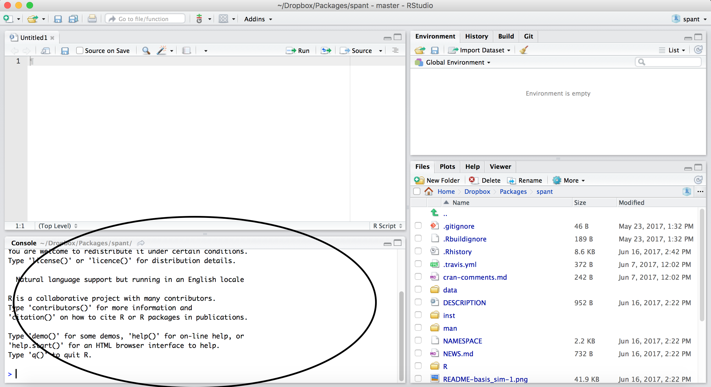

Click the top left button to create a new script:

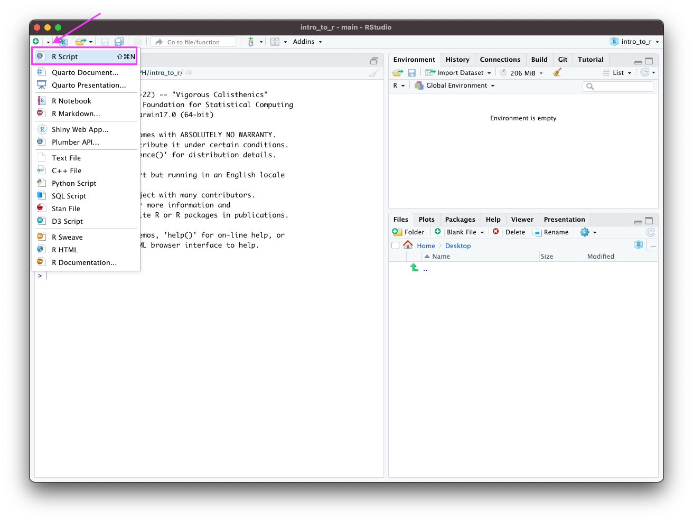

`RStudio`, should now look like this:

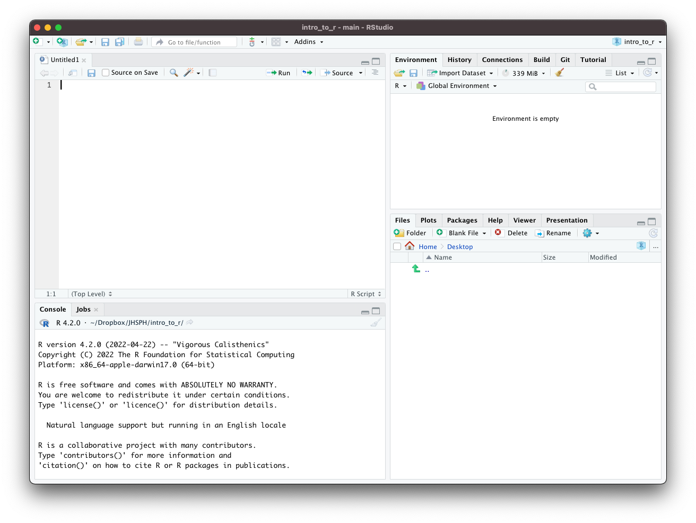

There are four main windows.

-   The **console** is the lower-left window where you can run lines of code and see the output.

-   The **script window** is the upper-left window where you can edit and write scripts or markdown documents. From the script window, you can run the current line of code in your script (or multiple lines if you highlight multiple rows) by pressing

    -   `CMD` + `Return` on Mac
    -   `CTRL` + `Enter` on Windows

-   The **workspace** is the upper-right window where you can manage your data and variables and see previous commands entered (under the history tab).

-   The **plots** window allows you to see the output of plots. On the other tabs, you can also look at directories, install packages, and look at help files for various `R` commands.

You can customize the look of your RStudio IDE in `Tools > Global Options...`.

## `R` Packages 

Packages are the fundamental units of reproducible `R` code. They are collections of `R` code that typically share some common purpose. Examples:

-   `dplyr` - package of functions for fast data set manipulation (subsetting, summarizing, rearranging, and joining together data sets);

-   `ggplot2` - "R's famous package for making beautiful graphics"; allows to build multiple-layers, highly customizable plots.


## Installing and Loading `R` Packages 

-   To install an `R` package, type in the `RStudio` console

        install.packages("replace_with_package_name")

    and press enter to execute the command.

-   Once a package is installed, to use its contents in current `R` session, we run in the `RStudio` console the command

        library(replace_with_package_name)

(Note the difference in presence of the quotation mark in the two above commands.)


## Working with R -- RStudio

RStudio is an Integrated Development Environment (IDE) for R

-   It helps the user effectively use R
-   Makes things easier
-   Is NOT a dropdown statistical tool (such as Stata)
    -   See [Rcmdr](https://cran.r-project.org/web/packages/Rcmdr/index.html) or [Radiant](http://vnijs.github.io/radiant/)
-   All R Studio snapshots are taken from <http://ayeimanol-r.net/2013/04/21/289/>

```{r, fig.alt="RStudio logo", out.width = "30%", echo = FALSE, fig.align='center'}
knitr::include_graphics("https://d33wubrfki0l68.cloudfront.net/62bcc8535a06077094ca3c29c383e37ad7334311/a263f/assets/img/logo.svg")
```

<sub>[[source](https://www.rstudio.com/)]</sub>

## RStudio

Easier working with R

-   Syntax highlighting, code completion, and smart indentation
-   Easily manage multiple working directories and projects

More information

-   Workspace browser and data viewer
-   Plot history, zooming, and flexible image and file export
-   Integrated R help and documentation
-   Searchable command history

## RStudio

```{r, fig.alt="RStudio", out.width = "80%", echo = FALSE, fig.align='center'}
knitr::include_graphics("https://ayeimanolr.files.wordpress.com/2013/04/r-rstudio-1-1.png?w=640&h=382")
```

<!-- ## RStudio/R Console 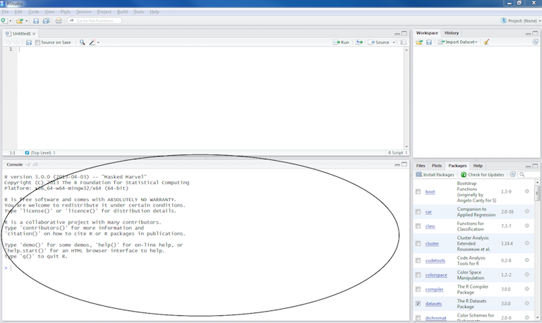 -->

## Getting the editor

```{r, out.width = "90%", echo = FALSE}
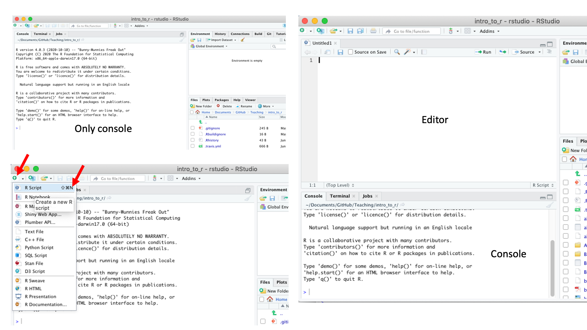
```

## Working with R in R Studio - 2 major panes:

1)  The **Source/Editor**: "Analysis" Script + Interactive Exploration
    -   Static copy of what you did (reproducibility)
    -   Top by default
2)  The **R Console**: "interprets" whatever you type
    -   Calculator
    -   Try things out interactively, then add to your editor
    -   Bottom by default

## Source / Editor

-   Where files open to
-   Have R code and comments in them
-   Can highlight and press (CMD+Enter (Mac) or Ctrl+Enter (Windows)) to run the code

In a .R file (we call a script), code is saved on your disk

```{r, out.width = "90%", echo = FALSE}
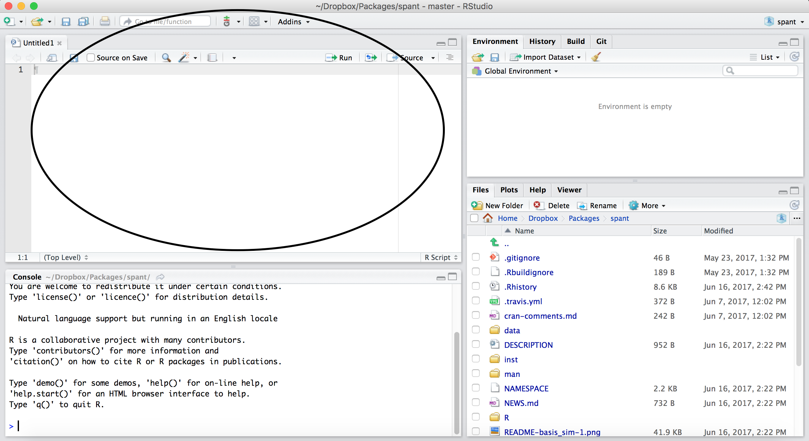
```

<!-- ## Workspace/Environment 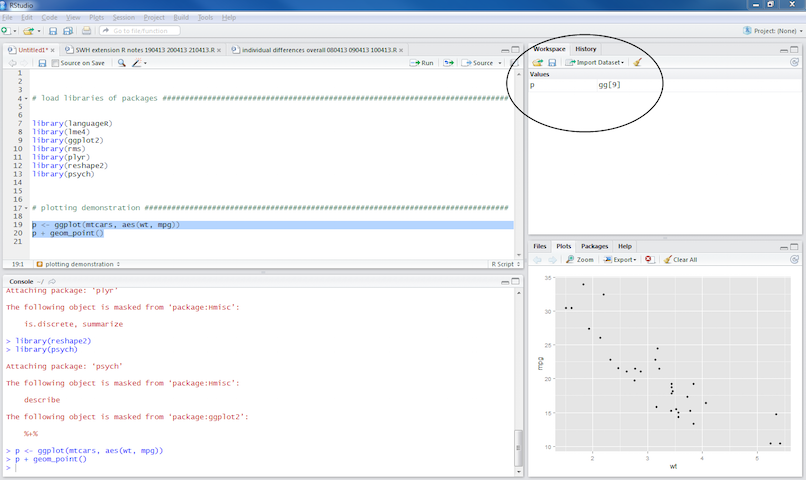 -->

## R Console

<!--  -->

```{r, out.width = "60%", echo = FALSE, fig.align='center'}
knitr::include_graphics("images/rstudio_console.png")
```

-   Where code is executed (where things happen)
-   You can type here for things interactively
-   Code is **not saved** on your disk

## RStudio

Super useful "cheat sheet": <https://github.com/rstudio/cheatsheets/raw/master/rstudio-ide.pdf>

```{r, fig.alt="RStudio", out.width = "65%", echo = FALSE, fig.align='center'}
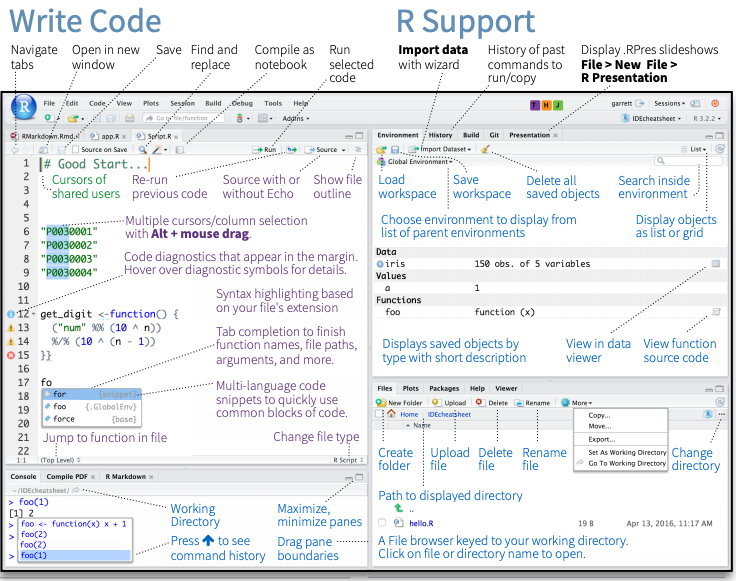
```

## RStudio layout

```{r, fig.alt="RStudio layout", out.width = "100%", echo = FALSE, fig.align='center'}
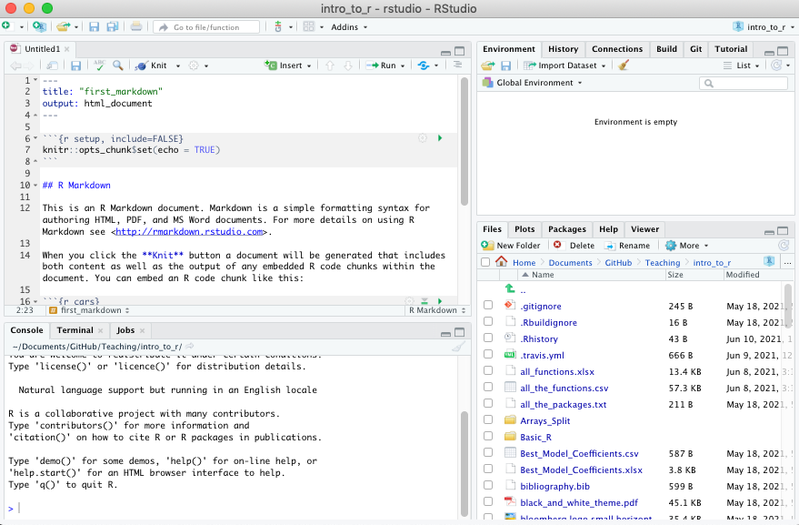
```

## RStudio Layout

If RStudio doesn't look the way you want (or like our RStudio), then do:

RStudio --\> Preferences --\> Pane Layout

```{r, out.width = "500px", echo = FALSE, fig.align='center'}
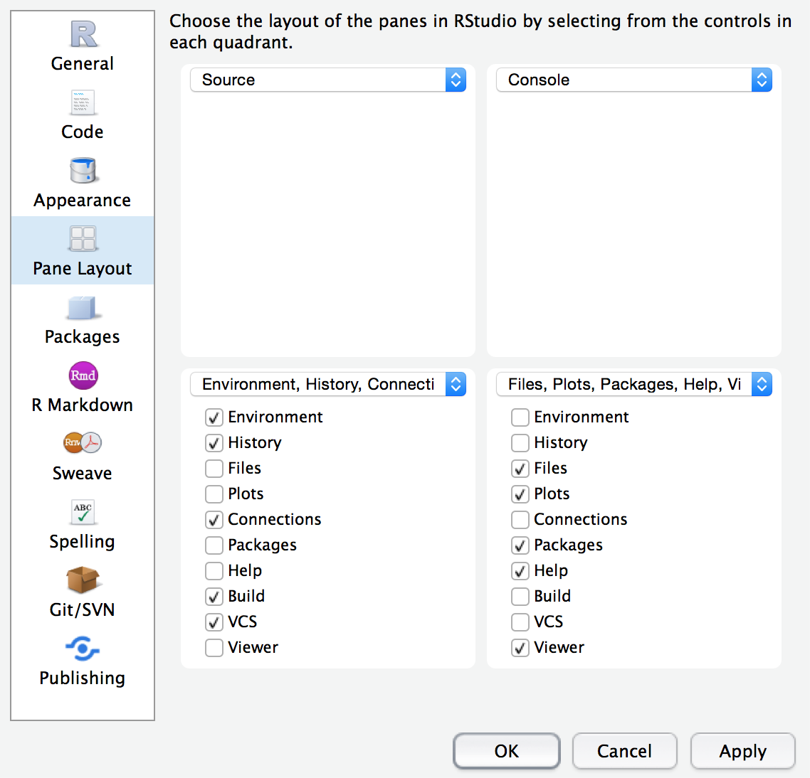
```

<!-- ## Source/Editor 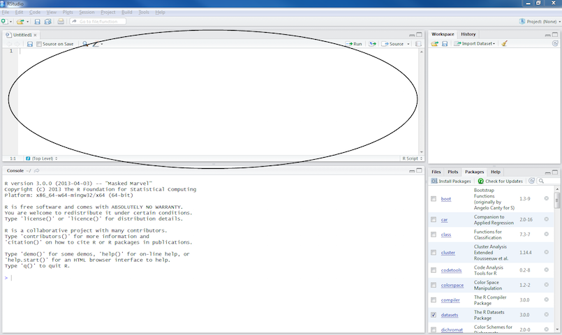 -->

## Workspace/Environment

<!-- 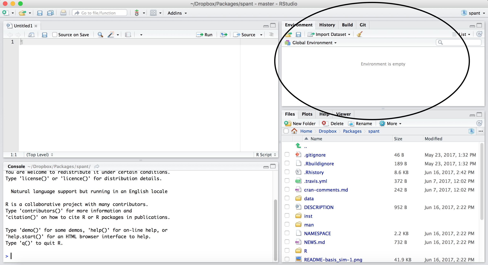 -->

```{r, out.width = "90%", echo = FALSE}

```

## Workspace/Environment

-   Tells you what **objects** are in R
-   What exists in memory/what is loaded?/what did I read in?

**History**

-   Shows previous commands. Good to look at for debugging, but **don't rely** on it.\
    Instead use RMarkdown!
-   Also type the "up" key in the Console to scroll through previous commands

## Other Panes

-   **Files** - shows the files on your computer of the directory you are working in
-   **Viewer** - can view data or R objects
-   **Help** - shows help of R commands
-   **Plots** - pictures and figures
-   **Packages** - list of R packages that are loaded in memory

# Let's take a look at R Studio ourselves!


## R Markdown file

R Markdown files (.Rmd) help generate reports that include your code and output. Think of them as fancier scripts.

1.  Helps you describe your code
2.  Allows you to check the output
3.  Can create many different file types

## Create an R Markdown file

Go to File → New File → R Markdown

Call your file "first_markdown"

```{r, out.width = "40%", echo = FALSE, fig.align='center'}
knitr::include_graphics("images/RMarkdown.png")
```

## Code chunks

Within R Markdown files are code "chunks"

This is where you can type R code and run it!

```{r, out.width = "80%", echo = FALSE, fig.align='center'}
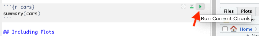
```

## Create Chunks

To create a new R code chunk:

Copy paste an existing chunk in the R Markdown file and replace the code **OR**

1)  Use the insert code chunk button at the top of RStudio.

```{r, out.width = "80%", echo = FALSE, fig.align='center'}
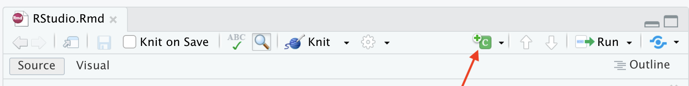
```

2)  Select R as the language:

```{r, out.width = "13%", echo = FALSE, fig.align='center'}
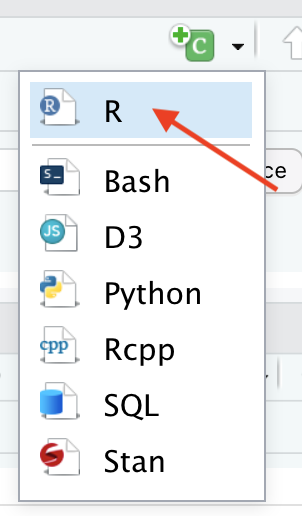
```

## Run previous chunks button

You can run all chunks above a specific chunk using this button:

```{r echo=FALSE, fig.align='center', out.width="80%"}
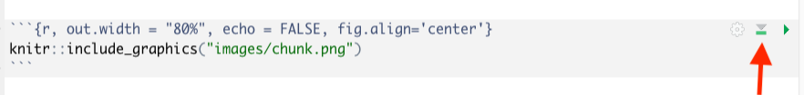
```

## Chunk settings

```{r echo=FALSE, fig.align='center', out.width="80%"}
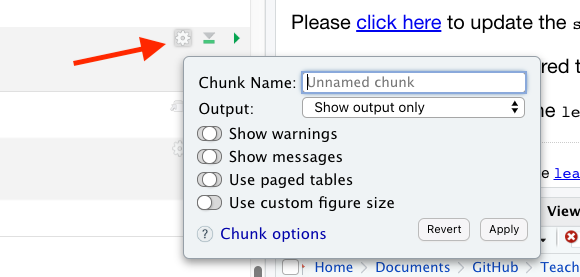
```

## Chunk settings

You can specify if a chunk will be seen in the report or not.

```{r echo=FALSE, fig.align='center', out.width="80%"}
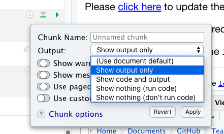
```

## Knit file to html

This will create a report from the R Markdown document!

```{r, fig.alt="knit", out.width = "100%", echo = FALSE, fig.align='center'}
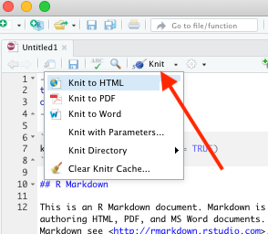
```

## Useful R Studio Shortcuts

-   `Ctrl + Enter` in your script evaluates that line of code
    -   It's like copying and pasting the code into the console for it to run.
-   `Ctrl+1` takes you to the script page
-   `Ctrl+2` takes you to the console
-   <http://www.rstudio.com/ide/docs/using/keyboard_shortcuts>


