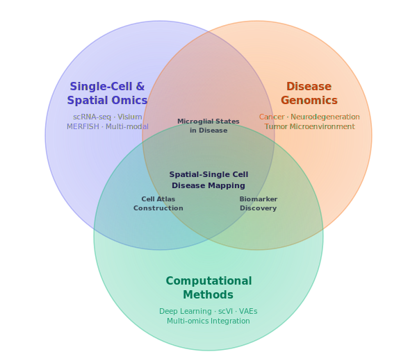

::: {#hero-heading}

{width=100% style="max-width:480px; display:block; margin:1.5rem auto;"}

:::

<!-- Newsletter push notification -->

✉️ &nbsp;Subscribe to my Newsletter
<button class="newsletter-toast-close" onclick="dismissNewsletter()" aria-label="Close">&#x2715;</button>

<iframe src="https://thehossainlab.substack.com/embed" width="100%" height="220" style="border:none; background:transparent;" frameborder="0" scrolling="no"></iframe>

