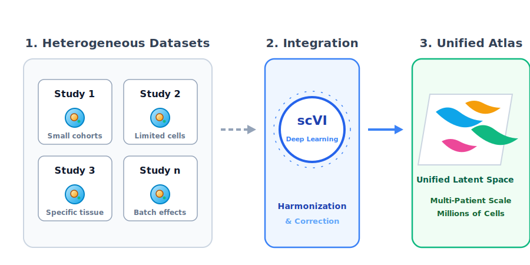

::: {#hero-heading}

<div class="research-svg-container">
{width=100% style="display:block; margin:0 auto;" loading="lazy"}
</div>

<div class="ro-why-box ro-why-box-sc" style="margin-top: 1.5rem; text-align: left;">
<span class="ro-why-label">Current Research Focus</span>
**Harmonized Cell Atlas:** Individual single-cell studies often involve a small number of tumors and cells, which can limit the generalizability of findings. To overcome this, I am integrating diverse single-cell datasets into a **harmonized cell atlas** covering thousands of cells across patients. By leveraging publicly available data and deep generative modeling (scVI), this framework builds a comprehensive reference for understanding cellular heterogeneity in health and disease. [Explore my research projects &rarr;](projects/index.qmd)
</div>

:::

```{=html}
<!-- Program Spotlight Notification -->
<div id="program-toast" class="program-toast no-print">
  <div class="program-toast-header">
    <span class="program-toast-title">🚀 Upcoming Programs</span>
    <button class="program-toast-close" onclick="dismissProgramToast()" aria-label="Close">&#x2715;</button>
  </div>
  
  <div class="program-tabs">
    <button class="tab-btn active" data-id="bmp" onclick="showProgram('bmp')">Research (BMP)</button>
    <button class="tab-btn" data-id="nocode" onclick="showProgram('nocode')">AI (No-Code)</button>
  </div>

  <div id="bmp-content" class="program-content active">
    <h4>Bioinformatics Mentorship Program</h4>
    <p>Go from raw sequencing data to a <strong>publication-ready manuscript</strong> in 12 weeks.</p>
    <div class="program-meta">
      <span>📅 12 Weeks</span>
      <span>🔬 NGS & Genomics</span>
    </div>
    <a href="https://mdjubayerhossain.com/bmp/" target="_blank" class="program-link">Learn More & Apply &rarr;</a>
  </div>

  <div id="nocode-content" class="program-content">
    <h4>No-Code & Agentic AI</h4>
    <p>Automate literature reviews and Omics analysis using <strong>Agentic AI</strong>—no coding required.</p>
    <div class="program-meta">
      <span>📅 4 Weeks</span>
      <span>🤖 LLMs & Agents</span>
    </div>
    <a href="https://mdjubayerhossain.com/NoCodeAI4LS/" target="_blank" class="program-link">Join the Revolution &rarr;</a>
  </div>
</div>

<script>
function showProgram(id) {
  // Update buttons
  document.querySelectorAll('.tab-btn').forEach(btn => {
    btn.classList.toggle('active', btn.getAttribute('data-id') === id);
  });
  
  // Update content
  document.querySelectorAll('.program-content').forEach(content => {
    content.classList.toggle('active', content.id === id + '-content');
  });
}

function dismissProgramToast() {
  const el = document.getElementById('program-toast');
  if (el) el.classList.remove('program-toast-show');
  localStorage.setItem('program-toast-dismissed', Date.now());
}

window.addEventListener('load', function() {
  // If not dismissed in the last 24 hours, show it
  const lastDismissed = localStorage.getItem('program-toast-dismissed');
  const shouldShow = !lastDismissed || (Date.now() - lastDismissed > 24 * 60 * 60 * 1000);
  
  if (shouldShow) {
    setTimeout(function() {
      const el = document.getElementById('program-toast');
      if (el) el.classList.add('program-toast-show');
    }, 2000);
  }
});
</script>
```
