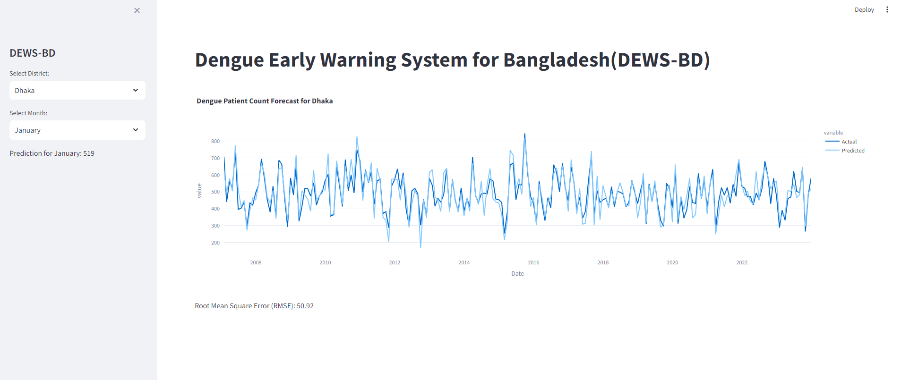

# Smartphones and Wearables for Cardiovascular Health

[View on Github](https://github.com/hdslbd/MW-HMS){.btn .btn-outline-primary .btn role="button" .btn-page-header .btn-xs}

The Mobile and Wearable Health Monitoring System (MW-HMS) is a proposed initiative to leverage data from smartphones and wearable devices to improve the understanding and management of cardiovascular health in Bangladesh. This project aims to merge personal monitoring data with existing health datasets to provide a comprehensive overview of cardiovascular health trends and risk factors within the population.

The MW-HMS project aims to revolutionize cardiovascular health management in Bangladesh by using cutting-edge technology and community engagement to provide timely and accurate health insights. This approach will not only enhance individual health outcomes but also improve public health strategies, significantly boosting the health system's capacity to manage and prevent cardiovascular diseases.

# Stroke Data Science Catalyst: Stroke Prevention and Management Data Initiative (SPMDI)

[Github](https://github.com/hdslbd/SPMDI){.btn .btn-outline-primary .btn role="button" .btn-page-header .btn-xs}

The Stroke Prevention and Management Data Initiative (SPMDI) is a proposed five-year collaborative research project in Bangladesh aimed at enhancing stroke prevention and treatment through the strategic use of health data. The initiative plans to integrate real-world data from hospitals, general practitioners, and pharmacies to thoroughly analyze stroke risk factors unique to the Bangladeshi population and develop customized interventions.

The SPMDI aims to diminish the incidence and effects of stroke in Bangladesh by providing actionable insights into prevention and management, ultimately enhancing the quality of life for individuals at risk and improving the overall healthcare landscape.

# Dengue Early Warning System for Bangladesh ( DEWS-BD)

[Github](https://github.com/hdslbd/DEWS-BD){.btn .btn-outline-primary .btn role="button" .btn-page-header .btn-xs}

DEWS-BD is an advanced early warning system designed to predict and mitigate dengue outbreaks in Bangladesh. By leveraging data science and machine learning techniques, DEWS-BD aims to provide accurate and timely predictions, enabling public health officials and policymakers to take proactive measures in combating dengue.

This project is ongoing and continuously updated to incorporate new data sources and improve prediction accuracy.

We would like to acknowledge the following organizations for their invaluable support and contributions to the DEWS-BD project:

- **Bangladesh Meteorological Department (BMD):** For providing the crucial meteorological data that underpins our predictive models and enables accurate forecasting of dengue outbreaks.
- **Directorate General of Health Services (DGHS):** For supplying the dengue case data, which is essential for training and validating our machine learning models and ensuring the reliability of our predictions.

