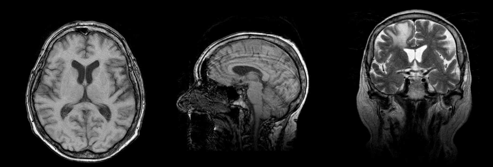

## Neuroepidemiology

```{r, echo=FALSE, message=FALSE, warning=FALSE, fig.align="center", out.width="100%"}

```

Deep learning, a subset of machine learning characterized by neural networks with multiple layers, has significantly advanced the field of neuroepidemiology. By harnessing the power of large neural networks and substantial datasets, researchers can uncover intricate patterns and correlations that traditional statistical methods might miss. In neuroepidemiology, deep learning algorithms analyze vast amounts of neurological data—ranging from MRI scans to genetic information—to identify biomarkers for disease, predict disease progression, and evaluate potential interventions. This approach not only enhances the accuracy of epidemiological predictions but also enables personalized medicine strategies by identifying the specific traits of neurological diseases in individual patients. By integrating deep learning techniques, my research aims to refine our understanding of neurological conditions, ultimately contributing to more effective and targeted treatments that are informed by a comprehensive analysis of big data insights.


