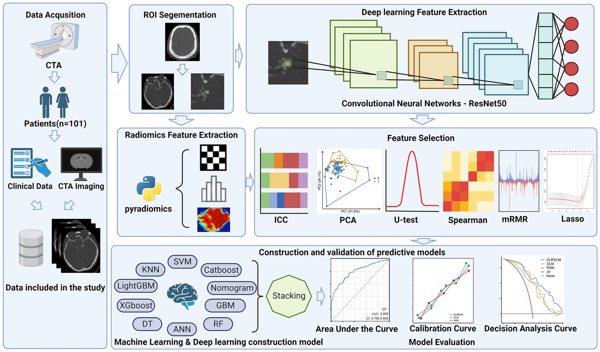
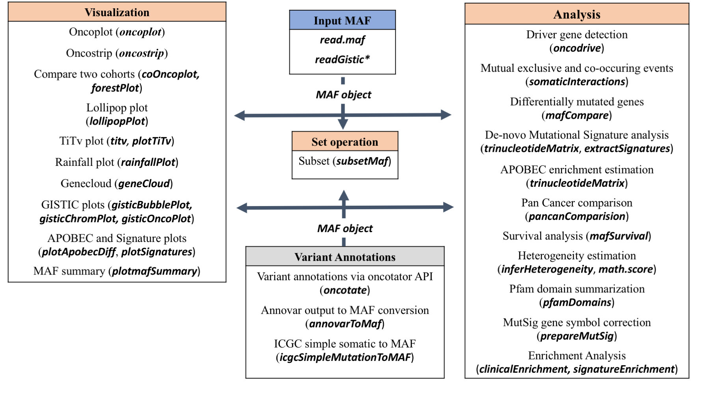

## AI for Neuroepidemiology
Deep learning, a subset of machine learning with neural networks of multiple layers, has revolutionized neuroepidemiology. By leveraging extensive datasets, it uncovers complex patterns in neurological data—like MRI scans and genetics—to pinpoint disease biomarkers, forecast progression, and assess interventions. This enhances predictive accuracy and supports personalized medicine, tailoring treatments based on individual neurological traits. Integrating deep learning aims to refine our grasp of neurological conditions, advancing precise and effective therapeutic strategies informed by comprehensive big data analysis.

{.lightbox}

# Somatic Mutation Analysis 
MAFtools in R is a versatile toolset for somatic mutation analysis in cancer research. It imports, visualizes, and analyzes Mutation Annotation Format (MAF) data, aiding in identifying mutation patterns, significant genes, and their clinical correlations.

