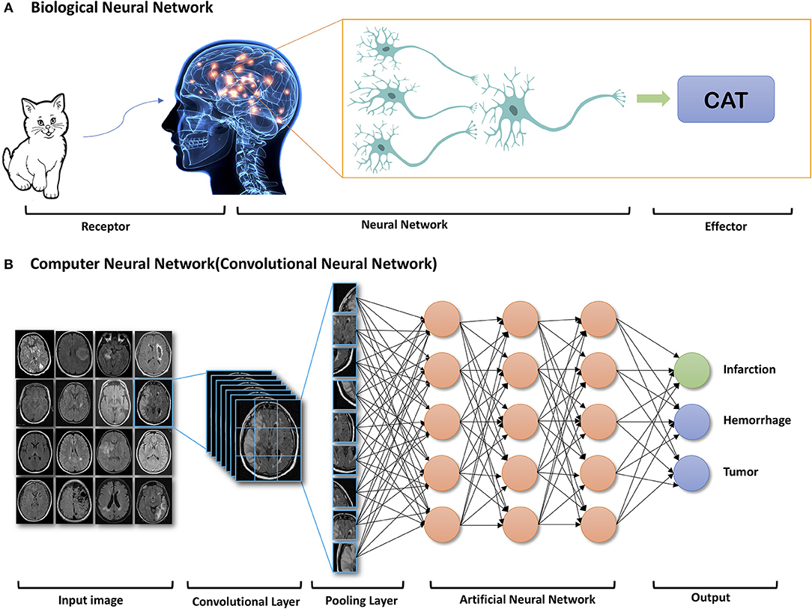

## Deep Learning to Neuro-Imaging Techniques
Deep learning has revolutionized clinical applications in radiology, offering advancements in classification, risk assessment, segmentation, diagnosis, prognosis, and therapy response prediction. Beyond diagnostic tasks, AI is transforming medical imaging by enhancing technical aspects such as artifact removal, image normalization, quality improvement, dose reduction, and accelerated imaging. My focuses on leveraging these deep learning innovations, particularly in neuroimaging, to improve diagnostic accuracy, optimize imaging protocols, and develop predictive models for neurological disorders.

```{r, dl-neuro-image}
#| echo: false
#| warning: false
#| message: false
#| fig-align: center
#| fig-cap: "Zhu et al., 2019"
#| fig-cap-location: bottom

```


