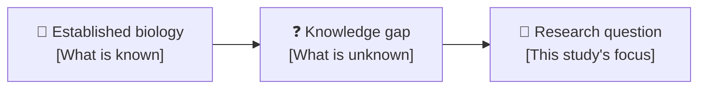
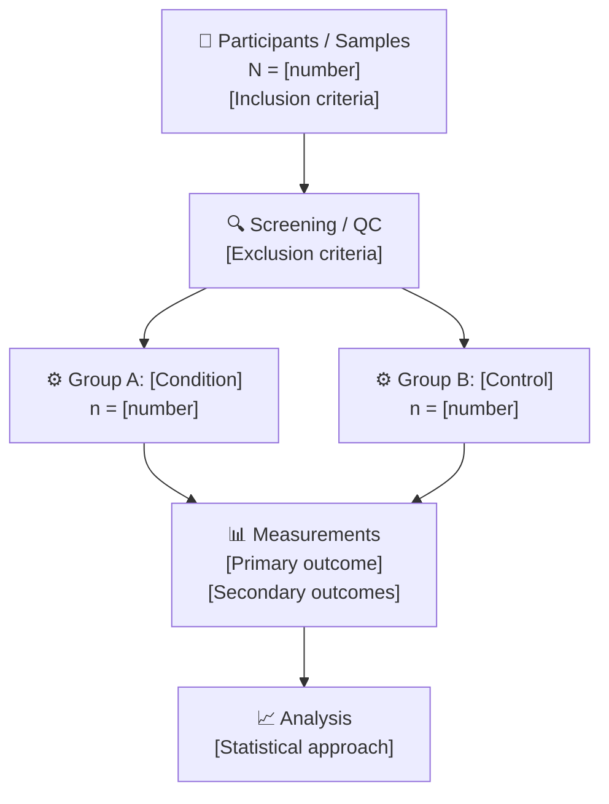
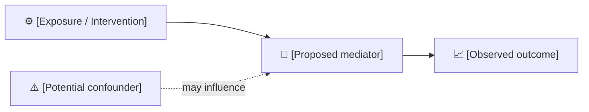
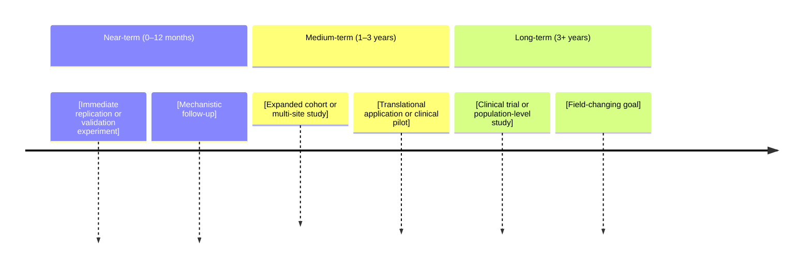

# [Research Title: Concise, Descriptive, Action-Oriented]

_[Context line — conference, journal club, lab meeting, or seminar | Date | Presenter name]_

---

## 🏠 Housekeeping

- **Slides:** [Link or location where slides will be shared]
- **Recording:** [Will / will not be recorded]
- **Questions:** [Hold until Q&A / Ask anytime / Use chat]
- **Conflicts of interest:** [Declare any relevant funding or affiliations, or "None declared"]

<strong>💬 Speaker Notes</strong>

- **Timing:** 2–3 minutes — get the room settled before starting science
- Mention if there are handouts, supplementary data, or preprints available
- If presenting remotely: confirm screen sharing and audio before housekeeping
- **Transition:** "With that covered, let me walk you through what we'll cover today."

---

## 📍 Agenda

- [x] Housekeeping (2 min)
- [ ] Background and motivation (5 min)
- [ ] Objectives and hypotheses (3 min)
- [ ] Methods and study design (8 min)
- [ ] Results (12 min)
- [ ] Discussion and interpretation (8 min)
- [ ] Conclusions and future directions (5 min)
- [ ] Q&A (10 min)

**Total:** ~53 minutes | **Talk only:** ~43 minutes

<strong>💬 Speaker Notes</strong>

- Reference this agenda at transitions: "We've covered the background, now let's turn to methods..."
- Q&A timing is flexible — shorten if talk runs long
- For shorter formats (15-min conference talk), compress to: Background → Objective → Key result → Conclusion → Q&A

---

## 🎯 Objectives

After this presentation, you will be able to:

- **Explain** [the core biological/scientific question being addressed and why it matters]
- **Describe** [the experimental approach and key methodological choices]
- **Interpret** [the main findings and their implications for the field]
- **Evaluate** [limitations and directions for future work]

<strong>💬 Speaker Notes</strong>

- State objectives clearly — this frames everything that follows
- For a conference talk, collapse to 1–2 outcomes
- Revisit at the end: "Let's check — did we address all four of these?"
- **Strong verbs for scientific talks:** Explain, Identify, Quantify, Compare, Characterize, Evaluate, Demonstrate, Distinguish, Propose

---

## 📚 Content

### Background and motivation

[1–2 sentences framing the broad scientific problem. Why does this matter to the field?]

**The gap in knowledge:**

- [What is currently known — key established finding]
- [What is unknown or contested — the gap your work addresses]
- [Why closing this gap matters — downstream impact or clinical/translational relevance]

> 💡 **Central question:** _[State the research question in one clear sentence.]_

<strong>💬 Speaker Notes</strong>

- Open with a compelling hook: a statistic, a clinical case, or a paradox in the literature
- "We've known X for decades — but we've never understood Y."
- Avoid jargon in the first two minutes; the audience is still calibrating
- Cite key foundational papers without dwelling on them — this is motivation, not a full review
- **Transition:** "Given this gap, we set out to [objective]."

---

### Objectives and hypotheses

**Primary objective:**

> [State the primary scientific objective in one sentence — what you set out to determine, quantify, or test.]

**Hypotheses:**

| Hypothesis | Prediction | Rationale |
| ---------- | ---------- | --------- |
| H₁ — [Short label] | [What you predicted would happen] | [Why — mechanistic or prior evidence] |
| H₂ — [Short label] | [What you predicted would happen] | [Why — mechanistic or prior evidence] |

**Primary outcome:** [The specific, measurable endpoint that tests H₁]

**Secondary outcomes:** [List any secondary endpoints]

<strong>💬 Speaker Notes</strong>

- Hypotheses should be falsifiable and stated before results — this builds credibility
- If this is exploratory (no formal hypothesis), say so explicitly: "This was a hypothesis-generating study"
- Pre-registration number if applicable: "This study was pre-registered at [registry] (#[ID])"
- **Transition:** "To test these hypotheses, we used the following approach."

---

### Methods and study design

**Study design overview:**

_[One sentence: e.g., "Prospective cohort study / Randomized controlled experiment / Retrospective analysis of..."]_

**Key methodological details:**

| Component | Description | Justification |
| --------- | ----------- | ------------- |
| **[Assay / instrument]** | [What it measures and how] | [Why this method was chosen] |
| **[Sample / cohort]** | [Population, N, demographics] | [Representativeness or generalizability] |
| **[Statistical test]** | [Test name and software] | [Assumptions met, power calculation] |

> ⚠️ **Potential confounders:** [List the main confounders and how they were controlled or acknowledged]

<strong>💬 Speaker Notes</strong>

- Methods should be detailed enough for replication, but this is a talk — don't read the methods section
- Highlight what is novel about the approach, not what is standard
- Address the most likely methodological critique preemptively: "You might wonder why we chose X over Y — we did so because..."
- Point to supplementary methods for the full protocol
- **Transition:** "With that experimental design in place, here's what we found."

---

### Results

#### Primary outcome

[1–2 sentences framing what you measured and the overall finding before showing data.]

Image placeholder: `images/fig1_primary_outcome.png`
_Figure 1: [What this figure shows — axis labels, group comparisons, statistical test and p-value]_

**Finding:** [One sentence stating the result in plain language — "We observed a significant X-fold increase in Y in condition A compared to control (p = [value], 95% CI [range])."][^1]

#### Secondary outcomes

[Briefly state secondary findings. Refer to supplementary figures for the full picture.]

Image placeholder: `images/fig2_secondary_outcomes.png`
_Figure 2: [Caption]_

**Comparison of groups:**

| Outcome | Group A | Group B | p-value | Effect size |
| ------- | ------- | ------- | ------- | ----------- |
| [Primary endpoint] | [Value ± SD] | [Value ± SD] | [p] | [Cohen's d / OR / HR] |
| [Secondary endpoint] | [Value ± SD] | [Value ± SD] | [p] | [Effect size] |
| [Secondary endpoint] | [Value ± SD] | [Value ± SD] | [p] | [Effect size] |

> 📌 **Key result:** [The single most important finding — the one sentence the audience will remember]

<strong>💬 Speaker Notes</strong>

- Lead with the answer, not the graph: "We found X. Here's the data supporting that."
- Don't describe every axis before showing the result — the audience reads graphs
- For null results: "We did not observe a significant difference. This matters because..."
- Anticipate: "What's the effect size? Is this clinically meaningful?"
- **Transition:** "Now let's talk about what this means."

---

### Discussion and interpretation

**What do our results mean?**

[2–3 sentences interpreting the primary finding in the context of the hypothesis: was it confirmed, refuted, or more nuanced?]

**Comparison with prior literature:**

| Study | Finding | Agreement with ours? | Possible explanation for difference |
| ----- | ------- | -------------------- | ----------------------------------- |
| [Author, Year][^2] | [Their result] | ✅ Consistent / ❌ Contradicts | [Methodological or population difference] |
| [Author, Year][^3] | [Their result] | ✅ / ❌ | [Explanation] |

**Proposed mechanism:**

**Limitations:**

- **[Limitation 1]** — [Impact and how it was mitigated or acknowledged]
- **[Limitation 2]** — [Impact and mitigation]
- **[Limitation 3]** — [Impact and mitigation]

<strong>💬 Speaker Notes</strong>

- Don't just list limitations — frame them as what's known vs. what remains uncertain
- Address the most obvious critique before the audience raises it
- "This study cannot establish causality because... Future RCTs could address this."
- Compare to prior literature honestly — if your result contradicts a high-profile paper, say why yours might differ
- **Transition:** "Given these findings and their limitations, here's where we land."

---

## ✍️ Conclusions and next steps

### Key takeaways

1. **[Takeaway 1]** — [One sentence. Restate the primary finding in plain language.]
2. **[Takeaway 2]** — [One sentence. What does this mean for the field or for practice?]
3. **[Takeaway 3]** — [One sentence. What is the most important open question?]

### Future directions

### Action items

| Action | Owner | Timeline |
| ------ | ----- | -------- |
| [Manuscript submission to target journal] | [Name] | [Date] |
| [Data deposition to public repository] | [Name] | [Date] |
| [Follow-up experiment] | [Name] | [Date] |

<strong>💬 Speaker Notes</strong>

- Revisit the four objectives stated at the start: "Did we deliver on each of these?"
- End with the "so what" — why should this audience care about your future work?
- Leave the audience with one memorable line: the core contribution in a single sentence
- "Thank you — I'm happy to take questions. Our preprint / paper is at [DOI]."

---

## 🔗 References and resources

### Acknowledgments

_This work was supported by [funding agency, grant number]. [Collaborators and their contributions. Core facilities used.]_

### Sources cited

_All footnote references from the presentation:_

[^1]: [Author(s)]. ([Year]). "[Title of paper]." _[Journal]_ [Volume]([Issue]): [Pages]. https://doi.org/[DOI]
[^2]: [Author(s)]. ([Year]). "[Title of paper]." _[Journal]_ [Volume]([Issue]): [Pages]. https://doi.org/[DOI]
[^3]: [Author(s)]. ([Year]). "[Title of paper]." _[Journal]_ [Volume]([Issue]): [Pages]. https://doi.org/[DOI]

### Data and code availability

- **Dataset:** [Repository name and DOI/URL, or "Available upon reasonable request"]
- **Analysis code:** [GitHub/Zenodo link, or "Available upon reasonable request"]
- **Preprint:** [bioRxiv/medRxiv DOI if applicable]

### Further reading

- [Key review or foundational paper](https://doi.org) — Why this is the best starting point
- [Methods paper](https://doi.org) — For readers who want to understand the approach in depth

<strong>💬 Speaker Notes</strong>

- Acknowledge funders, collaborators, and core facilities before the thank-you slide
- "All data and code are publicly available at the links in the slides"
- "The preprint is available now — I'd welcome your feedback"
- For journal club / lab meeting: "I'm happy to share the full paper with anyone who wants it"

---

_Last updated: [Date] | Template version: 1.0_
