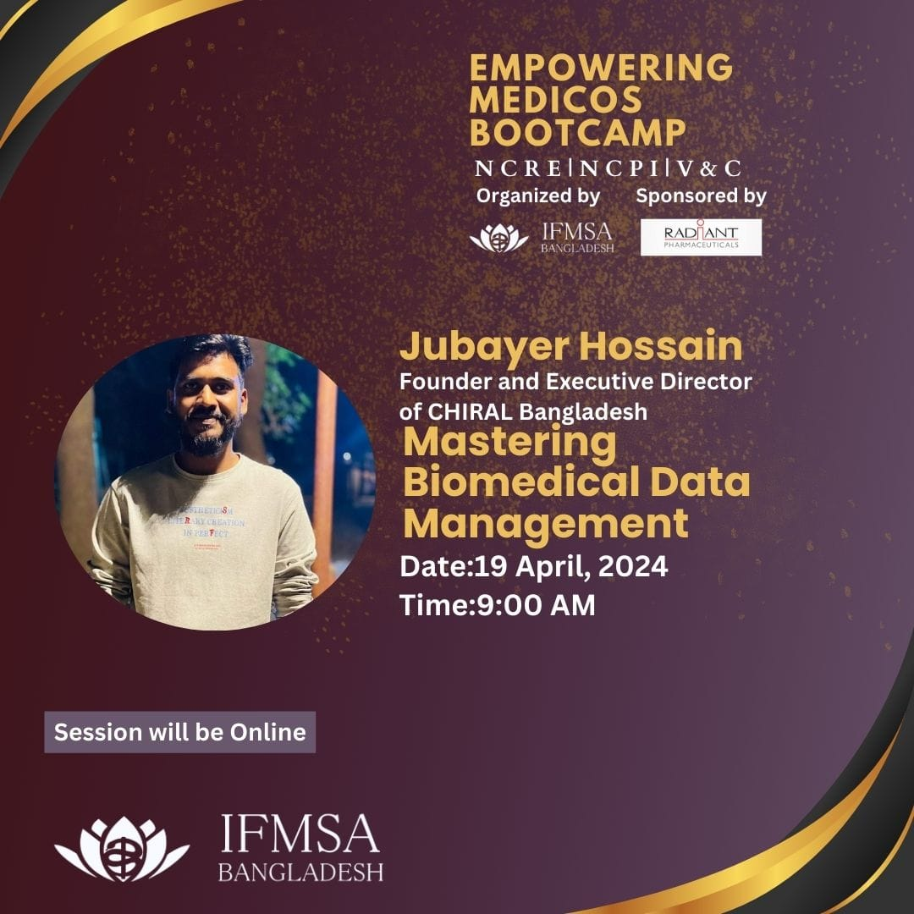

In the era of big data and advanced technologies, the management of biomedical data presents both immense opportunities and significant challenges. In this talk, we will explore the strategies and techniques essential for mastering biomedical data management. From acquisition and storage to processing and analysis, effective management of biomedical data is crucial for advancing research, improving healthcare outcomes, and driving innovation. We will delve into key topics such as data standardization, integration, security, and interoperability, highlighting best practices and emerging trends in the field. Additionally, we will discuss the role of artificial intelligence and machine learning in enhancing biomedical data management processes. By mastering biomedical data management, researchers and healthcare professionals can unlock the full potential of data-driven approaches to address complex biomedical challenges and ultimately improve patient care.

