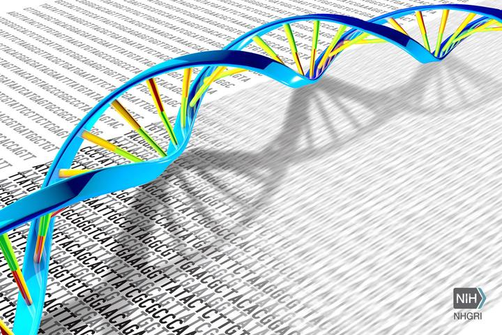

Genomics is the study of whole genomes of organisms, and incorporates elements from ge- netics. Genomics uses a combination of recombinant DNA, DNA sequencing methods, and bioinformatics to sequence, assemble, and analyse the structure and function of genomes. Genomics have become an inter-disciplinary(Computer Science, Statistics, Biology) sci- ence. The genomic data analysis steps typically include data collection, quality check and cleaning, processing, modeling, visualization and reporting.