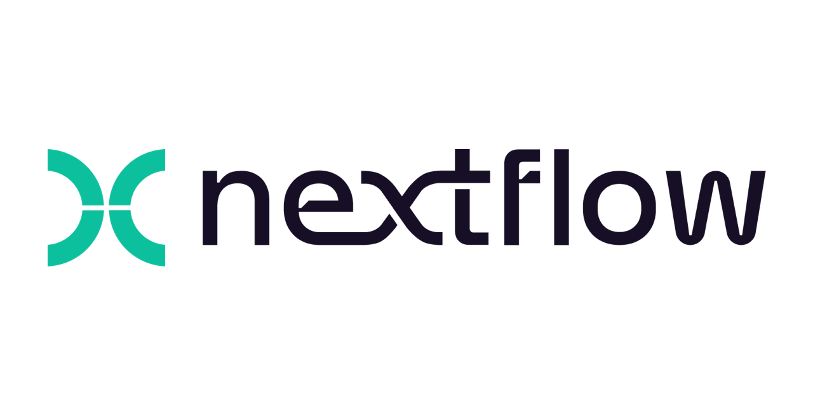

```{=html}
<div class="tut-series-overview">
<div class="tut-logos-row">


</div>
<div class="tut-stat-group">
<div class="tut-stat-item"><span class="tut-stat-val">15</span><span class="tut-stat-lbl">Lessons</span></div>
<div class="tut-stat-item"><span class="tut-stat-val">5</span><span class="tut-stat-lbl">Modules</span></div>
<div class="tut-stat-item"><span class="tut-stat-val">DSL2</span><span class="tut-stat-lbl">Language</span></div>
<div class="tut-stat-item"><span class="tut-stat-val">All Levels</span><span class="tut-stat-lbl">Audience</span></div>
<div class="tut-stat-item"><span class="tut-stat-val">Free</span><span class="tut-stat-lbl">Access</span></div>
</div>
<div class="tut-tools-row">
<span class="tut-tool-chip">Nextflow</span>
<span class="tut-tool-chip">nf-core</span>
<span class="tut-tool-chip">Docker</span>
<span class="tut-tool-chip">Singularity</span>
<span class="tut-tool-chip">conda</span>
<span class="tut-tool-chip">SLURM</span>
<span class="tut-tool-chip">nf-test</span>
</div>
</div>
```

:::{#tutorials}
:::
