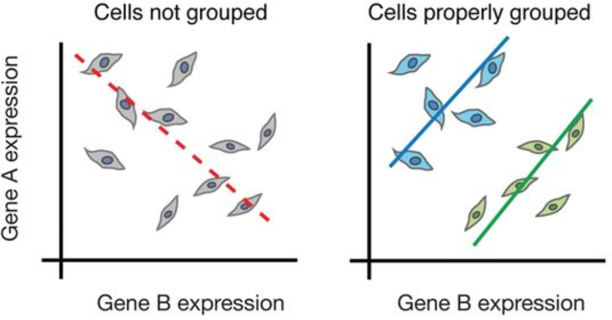
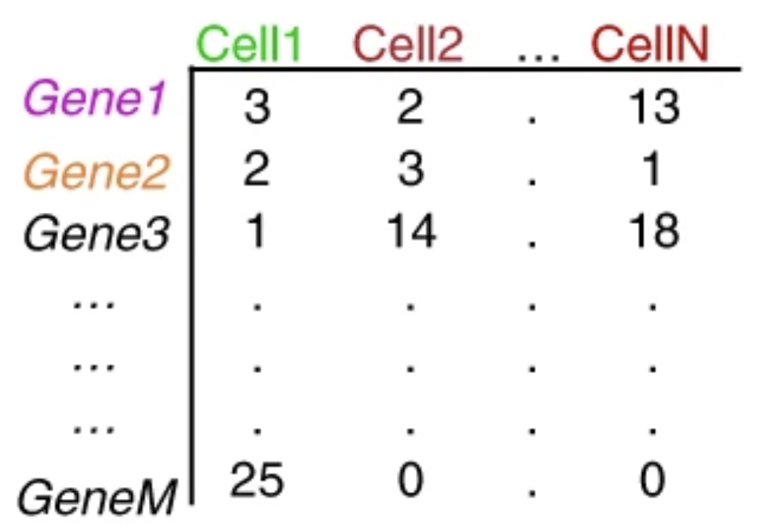
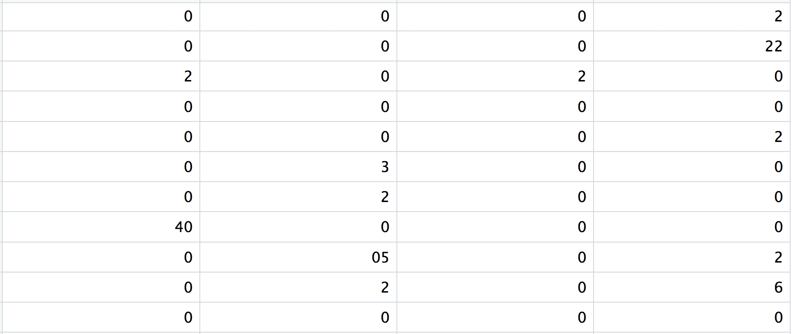
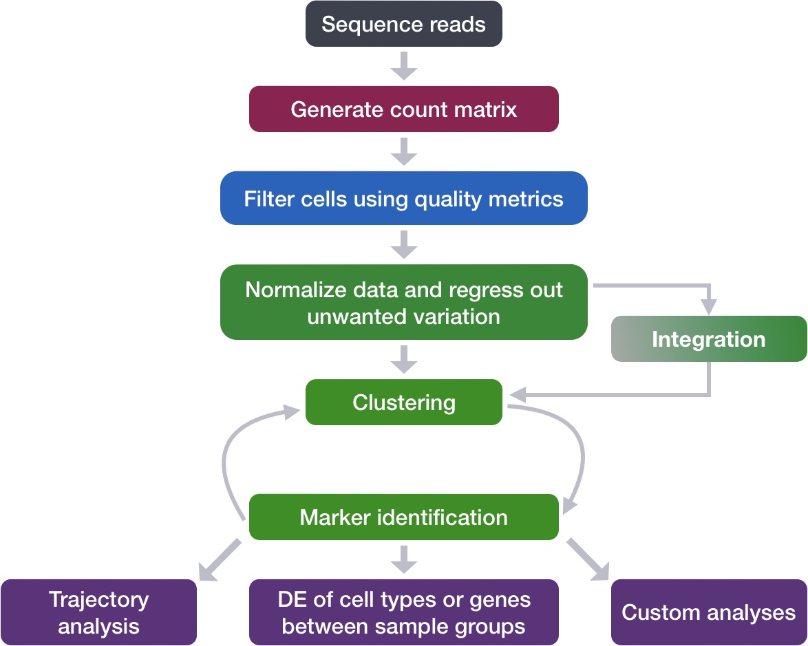

::: {.callout-note}
## Learning Objectives

By the end of this tutorial you will be able to:

- Explain **why** single-cell RNA-seq was invented and what bulk approaches cannot reveal
- Describe the key wet-lab steps that generate scRNA-seq data
- Understand what **cell barcodes** and **UMIs** are, and why they are indispensable
- Read and interpret a **gene × cell count matrix**
- Appreciate the **dropout problem** and why scRNA-seq data is inherently sparse
- Navigate the standard **computational analysis pipeline** at a conceptual level
- Know the core **Python tools** (the scverse ecosystem) used throughout this series

**Estimated reading time:** 20–25 minutes
**Prerequisites:** None — this is the starting point
:::

---

## 1. The Averaging Problem: Why Single-Cell?

In 2011, a study of colorectal cancer tumours used bulk RNA-seq and concluded that the tumour immune microenvironment was immunosuppressed. A decade later, single-cell analysis of the same tumour type revealed something far more complex: within what bulk analysis called "immunosuppressed", there were activated cytotoxic T cells trying to kill, Tregs blocking them, exhausted CD8+ cells giving up, and M2-polarised macrophages fuelling the tumour — all co-existing in the same biopsy [@Zhangetal2020]. Bulk sequencing had **averaged** all of this into silence.

This is the core problem. When you take a tissue and homogenise it for bulk RNA-seq, you are computing a **weighted average** of the transcriptomes of every cell type present. The signal you measure is not the signal of any real cell — it is an artefact of mixture proportions.

{fig-align="center" width="75%"}

The consequence is profound. Rare cell types that constitute 1–2% of a tissue are invisible. Transitional states between mature cell types are blurred away. A stimulus that activates 30% of T cells while leaving 70% unaffected looks like a mild, uniform response. Tumour subclones with distinct mutation profiles are averaged together.

Single-cell RNA sequencing (**scRNA-seq**) solves this by measuring the transcriptome of **each cell individually** — turning a single averaged measurement into a data matrix with one row per cell, capturing the true diversity of biological states.

::: {.callout-tip}
## Bulk vs Single-Cell: When to Use Which

scRNA-seq is not always the right choice. Bulk RNA-seq is cheaper, more sensitive (detects low-abundance transcripts reliably), and better for large-cohort studies. Use scRNA-seq when your biological question is about **cell type composition, rare populations, cellular heterogeneity, or cell state transitions**. For straightforward differential expression across conditions with known cell types, bulk RNA-seq remains powerful and cost-effective.
:::

---

## 2. A Decade That Changed Biology

The idea of sequencing a single cell's transcriptome was demonstrated as early as 2009 by Tang et al., who sequenced the transcriptome of a single mouse oocyte using a custom amplification protocol [@Tangetal2009]. The data were sparse and the throughput was one cell at a time — but the proof of concept was established.

The real revolution came in **2015**, when two groups published back-to-back in the same issue of *Cell*:

::: {.callout-important}
## Two Papers That Changed Everything (Published the Same Week)

**Macosko et al., 2015 — Drop-seq** [@Macoskoetal2015]
Encapsulated single cells in nanolitre-scale aqueous droplets alongside DNA-barcoded beads in an oil stream. Profiled **44,808 retinal cells** from the mouse retina in a single experiment, discovering 39 transcriptionally distinct cell populations. Cost per cell dropped to **\$0.06** — orders of magnitude cheaper than any previous method.

**Klein et al., 2015 — inDrop** [@Kleinetal2015]
Published simultaneously, independently arriving at a nearly identical droplet-based solution. Profiled mouse embryonic stem cells undergoing differentiation, capturing continuous transcriptional trajectories invisible to bulk methods.

These papers established the **droplet microfluidics** paradigm that dominates the field today.
:::

By 2017, **10x Genomics** had commercialised droplet capture into the **Chromium** platform, making scRNA-seq accessible to any lab with \$50,000 and an Illumina sequencer. Zheng et al. demonstrated profiling of **1.3 million mouse brain cells** in a single run [@Zhengetal2017]. That same year, the **Human Cell Atlas** consortium was announced — an international effort to map every cell type in the human body [@HCA2017].

The pace accelerated. By 2023, single-cell atlases existed for the entire human immune system, the developing brain, the lung across COVID-19 severity, and dozens of tumour types. What Tang et al. did painstakingly for one cell in 2009, researchers now do for a million cells before lunch.

---

## 3. Inside the Experiment: From Tissue to Library

Understanding the wet-lab pipeline is essential for interpreting the data computationally. Every artefact you will encounter — batch effects, dropouts, doublets — has a specific biological or technical origin in the experiment.

### 3.1 Starting Material: The Single-Cell Suspension

scRNA-seq requires a **single-cell suspension** — individual cells floating freely in buffer, not clumped or embedded in tissue. Achieving this from solid tissues requires enzymatic and/or mechanical dissociation, which introduces its own artefacts:

- **Stress response genes** (*FOS*, *JUN*, *HSPA1A*) are upregulated during dissociation, a phenomenon well-documented in brain tissue [@vande2019]. This can create spurious "activation" clusters.
- **Fragile cell types** (neurons, adipocytes) are preferentially lost during dissociation, biasing the recovered cell composition.
- **Time on ice** and **cold vs warm dissociation** protocols produce measurably different transcriptomes.

Blood (PBMCs) and bone marrow are fortunate exceptions — cells already exist in suspension and require minimal processing. This is why PBMC datasets dominate the benchmarking literature.

### 3.2 Capturing Individual Cells: Three Strategies

Modern platforms split into three broad families based on how they physically isolate single cells:

{fig-align="center" width="90%"}

**Droplet-based methods** (10x Chromium, Drop-seq, inDrop) are by far the most widely used. Cells and barcoded beads are co-encapsulated in oil droplets at nanolitre scale. Throughput is 500–10,000 cells per run, cost per cell is very low (~\$0.10–0.50), but only the 3′ or 5′ end of transcripts is captured.

**Plate-based methods** (Smart-seq2, Smart-seq3) sort individual cells into wells of a 96- or 384-well plate. Each cell is processed separately. Throughput is low (96–384 cells per run), cost per cell is high, but **full-length transcript coverage** enables detection of splice variants, allele-specific expression, and V(D)J recombination.

**Split-pool barcoding** (SPLiT-seq, SHARE-seq) barcodes cells in situ through multiple rounds of split-pool ligation — **no physical separation required**. Cells are fixed, split across many wells, ligated with a unique barcode, pooled, then split again. Theoretically unlimited throughput.

For this tutorial series, we focus on the **10x Chromium** platform because it generates the majority of public datasets and is the current default in most research settings.

### 3.3 Inside the 10x Chromium: How a GEM Works

The key innovation of the 10x Chromium is the **Gel Bead in Emulsion (GEM)**. Here is what happens in the fraction of a second when a GEM forms:

1. A cell and a gel bead are co-encapsulated in an oil droplet
2. The gel bead dissolves, releasing millions of oligonucleotides, each carrying:
   - An **Illumina sequencing adapter**
   - A **16 bp cell barcode** (same sequence on all oligos from one bead — this is the cell's identity tag)
   - A **12 bp Unique Molecular Identifier (UMI)** (random sequence — unique per molecule)
   - A **poly-dT** anchor that captures polyadenylated mRNA
3. mRNA molecules in the droplet hybridise to the poly-dT
4. Reverse transcriptase converts them to cDNA with the barcode and UMI incorporated
5. Droplets are broken, cDNA from all cells is pooled, PCR-amplified, and sequenced together

The entire complexity of identifying which read came from which cell is handled **downstream by software** using the cell barcode sequence.

---

## 4. Barcodes and UMIs: The Digital Identity of Each Cell

The barcode-UMI system is one of the most elegant engineering decisions in modern genomics. Understanding it deeply will prevent many common analysis mistakes.

{fig-align="center" width="85%"}

### 4.1 The Cell Barcode

Every oligo on a given bead carries an **identical cell barcode** — a 16 bp sequence from a whitelist of ~6,000 to 8 million valid barcodes (depending on the kit version). After sequencing, software assigns each read to a cell by matching its barcode to this whitelist, allowing up to 1 mismatched base (hamming distance correction).

The number of unique cell barcodes detected — and the shape of the **barcode rank plot** — is how you assess how many real cells were captured (more on this in the QC tutorial).

### 4.2 The UMI and Why It Exists

PCR amplification is necessary to generate enough material for sequencing, but it distorts count estimates. A highly expressed gene might be amplified 1,000-fold while a lowly expressed gene is amplified only 10-fold — and this amplification efficiency varies between molecules. Without correction, you would be comparing amplification noise, not biology.

The UMI solves this: each mRNA molecule captured in a droplet receives a **unique 12 bp random tag** before PCR. After PCR, all copies of the same original molecule carry the same barcode+UMI combination. When counting expression, you count **unique UMIs, not reads**. Two reads with the same cell barcode, same gene, and same UMI are collapsed into a single count of 1.

::: {.callout-important}
## Why UMI Counting Matters

The transition from read counts to UMI counts was critical for making scRNA-seq data quantitative. Earlier methods without UMIs (e.g., early Smart-seq versions) counted reads, making normalization and comparison across cells unreliable. The introduction of UMIs in CEL-seq (Hashimshony et al., 2012) and their adoption across all major platforms is a key reason why scRNA-seq data became tractable.
:::

### 4.3 The Cell Ranger / STARsolo Pipeline

The journey from raw FASTQ reads to a count matrix involves several filtering steps, each with a specific biological rationale:

{fig-align="center" width="55%"}

At each step, reads are discarded for a specific reason — invalid barcode, unmapped sequence, multimapping, low base quality. The survivors — confidently mapped, uniquely barcoded reads with valid UMIs — are collapsed into the final count matrix.

The equivalent open-source tools are **STARsolo** (integrated into the STAR aligner) and **Alevin** (part of Salmon), which produce identical outputs while avoiding the Cell Ranger licence requirement.

---

## 5. The Count Matrix: Your Data Structure

The output of preprocessing is a **gene × cell count matrix** — the fundamental data object you will work with throughout this series.

::: {layout-ncol=2}
{fig-align="center"}

{fig-align="center"}
:::

A typical 10x Chromium experiment profiling human PBMCs might produce:

| Quantity | Typical value |
|---|---|
| Cells captured | 3,000 – 10,000 |
| Genes in genome | ~33,000 (human) |
| Genes detected per cell | 1,500 – 4,000 |
| Median UMIs per cell | 2,000 – 8,000 |
| Matrix sparsity | 90 – 95% zeros |
| Raw matrix size (dense) | ~5 GB |
| Raw matrix size (sparse) | ~50 MB |

### 5.1 The Dropout Problem

A gene that is expressed in a cell may still appear as zero in the count matrix. This happens because the **capture efficiency of the 10x platform is approximately 10–30%** — for every 10 mRNA molecules present in a cell, only 1–3 are captured, reverse-transcribed, and sequenced. Lowly expressed genes — those with only 1–5 copies per cell — frequently produce zero counts even when genuinely expressed. This is called **dropout**.

Dropout has important consequences:
- You cannot distinguish a **true biological zero** (gene not expressed) from a **technical zero** (gene expressed but not captured)
- Normalisation must account for the fact that total counts per cell reflect both biology and capture efficiency
- Imputation methods (MAGIC, scVI) attempt to statistically recover dropout values, though this remains controversial

::: {.callout-warning}
## The Sparsity Trap

A common mistake is treating all zeros as "not expressed". In reality, a zero in a single cell tells you very little. The signal in scRNA-seq lives in **patterns across many cells** — not in individual entries. Methods that rely on single-cell level values (e.g. naive correlation between genes) are severely distorted by sparsity. Always think at the population level.
:::

---

## 6. The Computational Pipeline: A Map of What's Ahead

The journey from a raw count matrix to biological insight spans several well-defined steps. The figure below shows the **complete modern analysis pipeline** as described by Luecken & Theis in their landmark methods review [@LueckenTheis2019]:

{fig-align="center" width="90%"}

Here is a concise map of each stage and where it lives in this series:

| Step | What it does | Tutorial |
|---|---|---|
| **QC** | Remove dead cells, doublets, low-quality barcodes | #4 |
| **Normalisation** | Correct for library size differences | #6 |
| **Feature selection** | Focus on highly variable genes | #6 |
| **Dimensionality reduction** | PCA → UMAP, compress 20,000 genes to 2D | #7–8 |
| **Clustering** | Group cells by transcriptional similarity | #9 |
| **Annotation** | Assign cell type labels to clusters | #10 |
| **Differential expression** | Compare gene programs between groups | Later |
| **Trajectory inference** | Model pseudotime, differentiation paths | Later |
| **Compositional analysis** | Compare cell type abundances across conditions | Later |

A simplified view of the core pipeline:

{fig-align="center" width="60%"}

---

## 7. What Single-Cell Resolution Actually Reveals

The reason scRNA-seq has become ubiquitous is not just technical capability — it is because the biology being revealed was **genuinely not accessible before**. There are at least five categories of biological variation that only single-cell resolution can capture:

{fig-align="center" width="75%"}

Let us look at three landmark studies that exemplify what this resolution makes possible:

### Disease-Associated Microglia in Alzheimer's Disease

Keren-Shaul et al. (2017) profiled microglia from the brains of Alzheimer's mouse models at single-cell resolution. Within what was previously considered a homogeneous "activated microglia" population, they discovered a transcriptionally distinct subpopulation — **disease-associated microglia (DAM)** — defined by upregulation of *Trem2*, *Apoe*, and *Lpl*, and downregulation of homeostatic genes *P2ry12* and *Cx3cr1* [@KerenShaul2017]. This TREM2-dependent transition had been completely invisible to bulk approaches because DAMs constitute a minority of total microglia. The discovery opened an entire therapeutic target space for Alzheimer's disease.

### Resolving T Cell Exhaustion in Melanoma

Tirosh et al. (2016) performed scRNA-seq on 4,645 cells from 19 melanoma tumours, resolving tumour cells, T cells, B cells, macrophages, and cancer-associated fibroblasts within each biopsy [@Tirosh2016Science]. They discovered that **intratumoural T cells** showed a continuous spectrum from functional to exhausted states — a trajectory that bulk T cell gene signatures had conflated into a single "dysfunction" category. They identified a cell-cycle-related gene programme in malignant cells that explained inter-tumour heterogeneity. This paper is still cited as a template for single-cell TME analysis.

### Multiplexing Samples to Eliminate Batch Effects

A practical landmark: Kang et al. (2018) introduced **cell multiplexing** using natural genetic variation. By pooling PBMCs from multiple donors into a single 10x run and then demultiplexing computationally by SNP profile (using the *demuxlet* tool), they could capture multiple samples simultaneously — **halving costs** and **eliminating batch effects** between samples within the same study [@Kang2018NatBiotech].

{fig-align="center" width="70%"}

This technique — or its modern relatives (hashtag oligos, MULTI-seq, CMO labelling) — is now standard practice in clinical scRNA-seq studies with multiple patients.

---

## 8. The Python Ecosystem: Your Toolkit

All analysis in this series uses the **scverse** — a coordinated ecosystem of Python packages that share a common data structure (AnnData) and design philosophy.

| Package | Role | Key operations |
|---|---|---|
| **anndata** | Data structure | Store and manipulate annotated data matrices |
| **scanpy** | Core analysis | QC, normalisation, PCA, UMAP, clustering, DE |
| **scvi-tools** | Deep generative models | Probabilistic normalisation, integration, doublet detection |
| **cellrank** | Trajectory inference | Cell fate prediction using RNA velocity and pseudotime |
| **squidpy** | Spatial transcriptomics | Spatial neighbourhood graphs, image analysis |
| **muon** | Multi-modal data | CITE-seq, ATAC+RNA, multi-omics integration |

The central object is the **AnnData** (Annotated Data) structure — a matrix-centric data container that keeps your count matrix, cell metadata, gene metadata, dimensionality reductions, and analysis results together in a single object. Tutorial #3 is dedicated entirely to understanding AnnData.

```python
import scanpy as sc

# This one line loads a count matrix and wraps it in AnnData
adata = sc.read_10x_mtx("filtered_feature_bc_matrix/")

# You now have:
adata         # AnnData object: 8,412 cells × 33,538 genes
adata.X       # The count matrix (sparse)
adata.obs     # Cell metadata (DataFrame)
adata.var     # Gene metadata (DataFrame)
```

If this looks unfamiliar, don't worry — we dedicate an entire tutorial to the AnnData structure before writing a single line of analysis code.

---

## 9. The Dataset We Will Use Throughout This Series

All tutorials in this series use a **real clinical scRNA-seq dataset** from a published study of human peripheral blood mononuclear cells (PBMCs) profiled across three conditions:

- **Control** (4 samples) — Healthy or untreated donors
- **Pre-treatment** (4 samples) — Patients before intervention
- **Post-treatment** (4 samples) — Same patients after intervention

The dataset consists of 12 count matrices stored as compressed CSV files (`.csv.gz`), with cells as columns and genes as rows. In total, you are working with **tens of thousands of real human immune cells** across a treatment time course — the kind of data that generates publishable biological findings.

::: {.callout-tip}
## Why This Dataset?

Clinical scRNA-seq datasets with paired pre/post samples are among the most powerful study designs in the field, because you can:

1. Identify which **cell types** expand or contract in response to treatment
2. Find which **gene programmes** are activated or suppressed within each cell type
3. Detect cell type-specific **treatment responders** vs non-responders

This is the exact type of analysis driving precision medicine applications today.
:::

We will not load this data until **Tutorial #3** (The AnnData Object Explained). For now, simply know that every figure you will produce — every UMAP, every heatmap, every volcano plot — will come from these 12 real human samples.

---

## 10. Summary

Single-cell RNA-seq is not just a more expensive version of bulk RNA-seq — it answers questions that bulk approaches are structurally incapable of addressing. The core insight is that biological tissues are **heterogeneous mixtures**, and averaging across that heterogeneity destroys the signal you care about.

The technology achieves single-cell resolution through **droplet microfluidics** (primarily) — co-encapsulating a cell and a barcoded bead, reverse-transcribing the cell's mRNA with a unique cell barcode and per-molecule UMI, then sequencing millions of tagged cDNA fragments in a single sequencer run.

The output — a **sparse gene × cell count matrix** — is the starting point for all computational analysis: QC, normalisation, dimensionality reduction, clustering, cell type annotation, and downstream biological interpretation.

The Python **scverse** ecosystem — centred on `scanpy` and `anndata` — provides a coherent, well-maintained framework for every step of this pipeline. In the next tutorial, you will set up your environment and install everything you need.

::: {.callout-note}
## Key Concepts Checklist

Before moving on, make sure you can explain:

- [ ] Why bulk RNA-seq fails to capture cellular heterogeneity
- [ ] What a GEM is and how a cell barcode is assigned
- [ ] The difference between a **read count** and a **UMI count**
- [ ] What the rows, columns, and values of a count matrix represent
- [ ] Why most entries in a count matrix are zero (dropout)
- [ ] The names and roles of the five core scverse packages
:::

---

## What's Next

**Tutorial #2 — Setting Up Your Python Environment**
Install scanpy, anndata, and the full scverse stack. Create a reproducible conda environment. Verify your installation with a Hello World single-cell analysis.

---

## References

::: {#refs}
:::

- **Tang F et al.** (2009). mRNA-Seq whole-transcriptome analysis of a single cell. *Nature Methods*, 6, 377–382. DOI: [10.1038/nmeth.1315](https://doi.org/10.1038/nmeth.1315)

- **Macosko EZ et al.** (2015). Highly parallel genome-wide expression profiling of individual cells using nanoliter droplets. *Cell*, 161(5), 1202–1214. DOI: [10.1016/j.cell.2015.05.002](https://doi.org/10.1016/j.cell.2015.05.002)

- **Klein AM et al.** (2015). Droplet barcoding for single-cell transcriptomics applied to embryonic stem cells. *Cell*, 161(5), 1187–1201. DOI: [10.1016/j.cell.2015.04.044](https://doi.org/10.1016/j.cell.2015.04.044)

- **Zheng GXY et al.** (2017). Massively parallel digital transcriptional profiling of single cells. *Nature Communications*, 8, 14049. DOI: [10.1038/ncomms14049](https://doi.org/10.1038/ncomms14049)

- **Regev A et al.** (2017). The Human Cell Atlas. *eLife*, 6, e27041. DOI: [10.7554/eLife.27041](https://doi.org/10.7554/eLife.27041)

- **Tirosh I et al.** (2016). Dissecting the multicellular ecosystem of metastatic melanoma by single-cell RNA-seq. *Science*, 352(6282), 189–196. DOI: [10.1126/science.aad0501](https://doi.org/10.1126/science.aad0501)

- **Keren-Shaul H et al.** (2017). A unique microglia type associated with restricting development of Alzheimer's disease. *Cell*, 169(7), 1276–1290. DOI: [10.1016/j.cell.2017.05.018](https://doi.org/10.1016/j.cell.2017.05.018)

- **Kang HM et al.** (2018). Multiplexed droplet single-cell RNA-sequencing using natural genetic variation. *Nature Biotechnology*, 36, 89–94. DOI: [10.1038/nbt.4042](https://doi.org/10.1038/nbt.4042)

- **Zhang L et al.** (2020). Lineage tracking reveals dynamic relationships of T cells in colorectal cancer. *Nature*, 564, 268–272. DOI: [10.1038/s41586-018-0694-x](https://doi.org/10.1038/s41586-018-0694-x)

- **Luecken MD & Theis FJ** (2019). Current best practices in single-cell RNA-seq analysis: a tutorial. *Molecular Systems Biology*, 15(6), e8746. DOI: [10.15252/msb.20188746](https://doi.org/10.15252/msb.20188746)

- **Papalexi E & Satija R** (2018). Single-cell RNA sequencing to explore immune cell heterogeneity. *Nature Reviews Immunology*, 18, 35–45. DOI: [10.1038/nri.2017.76](https://doi.org/10.1038/nri.2017.76)

- **van den Brink SC et al.** (2017). Single-cell sequencing reveals dissociation-induced gene expression in tissue subpopulations. *Nature Methods*, 14, 935–936. DOI: [10.1038/nmeth.4437](https://doi.org/10.1038/nmeth.4437)
